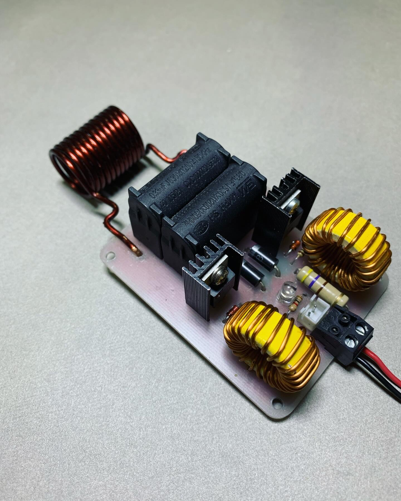

<!-- ================== PROJECT BANNER ================== -->

  <!-- Replace 'channel_logo.png' with your actual logo file inside 'assets' -->
  

<h1 align="center">MKIT-Induction-ZVS-120W</h1>

📌 Induction converter project with ZVS circuit and 120W power

<!-- ================== HERO IMAGE / GIF ================== -->
<!-- Replace 'hero_image.gif' with your actual file -->

  

<!-- ================== PROJECT IMAGE ================== -->

  

<!-- ================== PROJECT GIF ================== -->

  

<!-- ================== PROJECT DESCRIPTION ================== -->
## 📝 Project Description
The **MKIT-Induction-ZVS-120W** project is a **Zero Voltage Switching (ZVS) induction circuit** designed for applications such as induction heating and electronic component testing.  

Key Features:  
- Simple and efficient design  
- Output power up to 120W  
- Uses standard and easily available components  

<!-- ================== PROJECT DETAILS ================== -->
## ⚙️ Project Details

<!-- ================== SOCIAL LINKS ================== -->
## 🔗 Social Links

  
  &nbsp;&nbsp;&nbsp;
  
  &nbsp;&nbsp;&nbsp;
  
  &nbsp;&nbsp;&nbsp;
  

